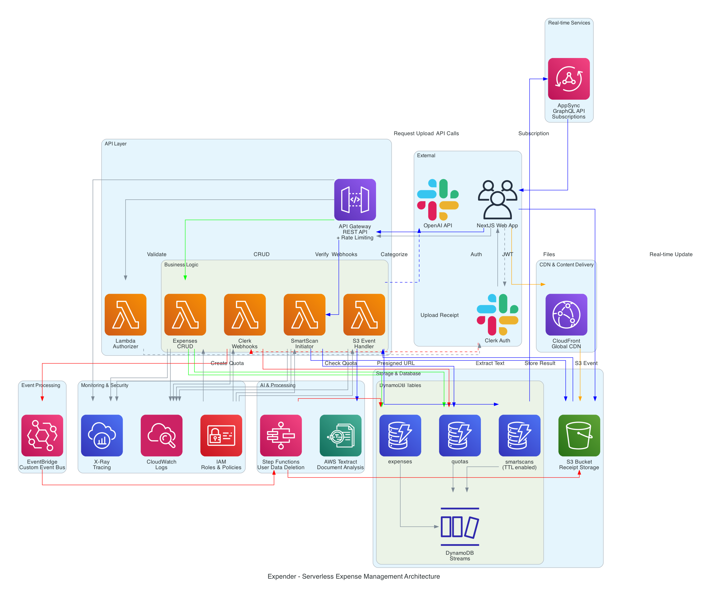

# Expender - Serverless Expense Management Platform

A comprehensive serverless expense tracking and management platform built on AWS. Expender combines AI-powered receipt scanning (SmartScan) with intelligent expense categorization, multi-tier user quotas, and real-time processing capabilities.

## Features

### Core Functionality

- **📊 Expense Management**: Create, read, update, and delete individual expenses with full CRUD operations
- **🗂️ Batch Operations**: Process multiple expenses simultaneously for bulk import/export workflows
- **📈 Data Export**: Export expenses to CSV format with customizable field selection
- **🔍 Smart Filtering**: Query expenses by date ranges, categories, and other criteria using DynamoDB GSI

### SmartScan Technology

- **🤖 AI-Powered Receipt Scanning**: Automated receipt processing using AWS Textract for data extraction
- **🧠 Intelligent Categorization**: OpenAI GPT-powered expense categorization based on merchant and line items
- **📷 Multi-Format Support**: Process images (JPEG, PNG) and PDF receipts up to 5MB
- **💱 Multi-Currency Detection**: Automatic currency recognition across 18+ global currencies
- **⚡ Real-Time Processing**: GraphQL subscriptions for live SmartScan result updates

### User Management & Security

- **🔐 Clerk Authentication**: Secure user authentication and authorization via Clerk
- **📋 Multi-Tier Quotas**: Free (30 scans/month) and Pro (unlimited) plan management
- **🚫 Rate Limiting**: API Gateway throttling with tier-specific limits for optimal performance
- **🗂️ Data Isolation**: Complete user data separation with secure deletion workflows

### Infrastructure & Monitoring

- **⚡ Serverless Architecture**: 100% serverless with auto-scaling Lambda functions
- **📊 CloudWatch Integration**: Comprehensive logging and monitoring with correlation
- **🔄 Event-Driven Design**: EventBridge, DynamoDB Streams, and S3 triggers for reactive processing
- **🌍 Global CDN**: CloudFront distribution for optimized file delivery
- **🛡️ Production-Ready**: Comprehensive error handling and middleware for reliability

## Architecture Overview



_Comprehensive AWS serverless architecture for Expender, showing the complete data flow from user authentication, expense management, receipt processing and real-time notifications through to account lifecycle management. Created with Amazon Q_

### Serverless Components

**API Layer:**

- **AWS API Gateway**: RESTful API with Lambda authorization and comprehensive rate limiting
- **AWS Lambda**: Event-driven functions for business logic processing
- **AWS Chalice**: Python framework for rapid serverless API development

**Data Storage:**

- **DynamoDB**: NoSQL database with streams for real-time event processing
  - `expenses`: Main expense records with date/category GSIs
  - `smartscans`: Temporary SmartScan results with TTL
  - `quotas`: User plan management and usage tracking
- **S3**: Secure file storage for receipt images and documents
- **CloudFront**: Global CDN for optimized file delivery

**AI & Processing:**

- **AWS Textract**: Automated document text and data extraction
- **OpenAI GPT**: Intelligent expense categorization with structured JSON responses
- **AppSync GraphQL**: Real-time subscriptions for SmartScan processing updates

**Event-Driven Architecture:**

- **EventBridge**: Custom event bus for user lifecycle management
- **DynamoDB Streams**: Real-time data change processing with filtering
- **Step Functions**: Orchestrated user data deletion workflows
- **S3 Event Notifications**: Automatic receipt processing triggers

**Monitoring & Security:**

- **AWS X-Ray**: Distributed tracing for performance monitoring
- **CloudWatch Logs**: Centralized logging with structured correlation
- **IAM**: Fine-grained permissions with least-privilege access
- **Clerk Webhooks**: Secure user lifecycle event handling

## Prerequisites

Before setting up Expender, ensure you have the following installed:

- **Python 3.12+**: Required for AWS Chalice and application code
- **AWS CLI**: Configured with appropriate IAM permissions
- **Terraform**: Version 1.0.0+ for infrastructure provisioning
- **AWS Chalice**: Python serverless framework (`pip install chalice`)
- **Node.js**: For integration with [the frontend](https://github.com/george-swift/expender) (optional)

### Required AWS Services Access

- Lambda, API Gateway, DynamoDB, S3, CloudFront
- Textract, EventBridge, Step Functions, AppSync
- IAM, CloudWatch, X-Ray

### External Service Requirements

- **Clerk Account**: For user authentication ([clerk.com](https://clerk.com/))
- **OpenAI API Key**: For AI-powered categorization ([openai.com](https://openai.com/))

## Installation

### 1. Clone the Repository

```bash
git clone https://github.com/george-swift/expender-backend.git
cd expender-backend
```

### 2. Set Up Python Environment

```bash
# Create virtual environment
python3 -m venv venv

# Activate virtual environment
source venv/bin/activate  # On macOS/Linux
# OR
venv\Scripts\activate     # On Windows

# Install dependencies
pip install -r requirements.txt
pip install -r requirements-dev.txt
```

### 3. Install Terraform

```bash
# macOS (using Homebrew)
brew install terraform

# Or download from: https://www.terraform.io/downloads
```

### 4. Configure AWS CLI

```bash
aws configure
# Provide your AWS Access Key ID, Secret, and default region
```

## Configuration

### Environment Variables

Create Terraform variable files for each environment:

#### `vars_dev.tfvars`

```hcl
# AWS Configuration
aws_region     = "us-east-1"
environment    = "dev"

# Frontend URLs
frontend_app_url     = "https://dev.app.url.here"
frontend_dev_app_url = "http://localhost:PORT"

# External Service Keys (use AWS Secrets Manager in production)
clerk_secret_key              = "your-clerk-secret-key"
clerk_webhook_signing_secret  = "your-clerk-webhook-secret"
openai_api_key               = "your-openai-api-key"
smartscan_encryption_key     = "your-32-character-encryption-key"
```

#### `vars_prod.tfvars`

```hcl
# AWS Configuration
aws_region     = "us-east-1"
environment    = "prod"

# Frontend URLs
frontend_app_url     = "https://prod.app.url.here"
frontend_dev_app_url = "https://dev.app.url.here"

# External Service Keys (AWS Secrets Manager preferably)
clerk_secret_key              = "your-production-clerk-secret-key"
clerk_webhook_signing_secret  = "your-production-clerk-webhook-secret"
openai_api_key               = "your-production-openai-api-key"
smartscan_encryption_key     = "your-production-32-character-encryption-key"
```

### Chalice Configuration

The application uses Chalice's automatic configuration. See full settings in `.chalice/config.json`:

```json
{
  "version": "2.0",
  "app_name": "expender",
  "manage_iam_role": false,
  "iam_role_arn": "${aws_iam_role.api_service_role.arn}",
  "automatic_layer": true,
  "xray": true,
  "stages": {
    "dev": {},
    "prod": {}
  }
}
```

### Security Configuration

**Environment Variables (Never commit to Git):**

- Store sensitive values in `*.tfvars` files (excluded by `.gitignore`)
- Use AWS Secrets Manager for production environments (PREFERRED)
- Rotate keys regularly and follow security best practices

## Deployment

### Development Environment

Deploy to development using the provided Makefile:

```bash
# Deploy to development environment
make deploy-dev
```

This command:

1. Formats Python code with Black
2. Packages the Chalice application for Terraform
3. Applies infrastructure patches for multi-environment compatibility
4. Deploys infrastructure using Terraform

### Production Environment

```bash
# Deploy to production environment
make deploy-prod
```

### Manual Deployment Steps

If you prefer manual deployment:

```bash
# 1. Format code
black .

# 2. Package Chalice application
chalice package --pkg-format terraform . --stage dev

# 3. Patch Terraform configuration
python3 scripts/patch_chalice_tf.py

# 4. Initialize Terraform (first time only)
terraform init

# 5. Plan deployment
terraform plan -var-file=vars_dev.tfvars

# 6. Apply infrastructure
terraform apply -var-file=vars_dev.tfvars
```

### Clean Up Resources

```bash
# Remove generated files
make clean

# Destroy infrastructure (be careful!)
terraform destroy -var-file=vars_dev.tfvars
```

## Usage

### API Endpoints

The API is documented in the Swagger specification (`expender-dev-swagger-postman.json`). Key endpoints include:

#### Expense Management

```bash
# List user expenses
GET /expenses
Authorization: {clerk-jwt-token}

# Create single expense
POST /expenses
Authorization: {clerk-jwt-token}
Content-Type: application/json
{
  "amount": 25.99,
  "merchant": "Coffee Shop",
  "category": "Meals and Entertainment",
  "date": "2025-08-07",
  "currency": "USD",
  "description": "Team meeting coffee"
}

# Batch create expenses
POST /expenses/batch
Authorization: {clerk-jwt-token}
Content-Type: application/json
{
  "expenses": [
    {
      "amount": 15.50,
      "currency": "USD",
      "merchant": "Amazing Lunch Place",
      "category": "Meals and Entertainment"
    },
    {
      "amount": 8.99,
      "currency": "USD",
      "merchant": "Awesome Office Supplies",
      "category": "Office Supplies"
    }
  ]
}

# Update expense
PUT /expenses/{expense_id}
Authorization: {clerk-jwt-token}
Content-Type: application/json
{
  "amount": 27.99,
  "category": "Professional Services"
}

# Delete expense
DELETE /expenses/{expense_id}
Authorization: {clerk-jwt-token}

# Export expenses to CSV
POST /expenses/export
Authorization: {clerk-jwt-token}
Content-Type: application/json
{
  "format": "csv",
  "attributes": ["date", "merchant", "amount", "category"]
}
```

#### SmartScan Operations

```bash
# Initiate SmartScan (get upload URL)
POST /smartscans
Authorization: {clerk-jwt-token}
Content-Type: application/json
{
  "contentType": "image/jpeg"
}

# Response includes presigned S3 upload URL and fields
# Upload receipt image using the provided URL and fields
# Results will be available via GraphQL subscription
```

#### User Quotas

```bash
# Check user quota and usage
GET /quotas
Authorization: {clerk-jwt-token}
```

### GraphQL API (SmartScan Results)

```graphql
# Subscribe to SmartScan results
subscription GetSmartScanResult($userId: String!, $scanId: String!) {
  getSmartScanResult(userId: $userId, scanId: $scanId) {
    userId
    scanId
    result {
      merchant
      amount
      currency
      date
      category
      confidence
      lineItems {
        description
        amount
        quantity
      }
    }
    objectKey
    createdAt
  }
}
```

### Rate Limits

The API implements tiered rate limiting:

**Free Tier Users:**

- 1,000 requests/day
- 10 requests/second (burst: 20)
- 30 SmartScans/month

**Pro Tier Users:**

- 10,000 requests/day
- 50 requests/second (burst: 100)
- Unlimited SmartScans

**Endpoint-Specific Limits:**

- SmartScan: 5-10 requests/second (resource intensive)
- Export: 2-5 requests/second (memory intensive)
- Webhooks: 50-100 requests/second (external callbacks)

## Troubleshooting

### Common Issues

#### 1. Deployment Failures

**CloudWatch Logs Role Error:**

```
Error: BadRequestException: CloudWatch Logs role ARN must be set
```

**Solution:** The deployment automatically creates the required CloudWatch role. Ensure your AWS account has API Gateway permissions.

#### 2. Authentication Issues

**Unauthorized API Calls:**

```json
{
  "message": "Unauthorized"
}
```

**Solution:** Ensure you're passing a valid Clerk JWT token in the Authorization header.

#### 3. SmartScan Processing

**Textract Analysis Failures:**

- Ensure uploaded files are under 5MB
- Supported formats: JPEG, PNG, PDF
- Check file is properly uploaded to S3 before processing

**AI Categorization Issues:**

- Verify OpenAI API key is valid and has sufficient credits
- Check CloudWatch logs for detailed error messages

#### 4. Rate Limiting

**Too Many Requests (429):**

- Check your user tier and current usage
- Implement exponential backoff in client applications
- Consider upgrading to Pro tier for higher limits

### Debug Tools

**CloudWatch Logs:**

```bash
# View API logs
aws logs tail /aws/lambda/expender-dev --follow

# View specific function logs
aws logs tail /aws/lambda/expender-dev-bucket_event_handler --follow
```

**X-Ray Tracing:**

- Visit AWS X-Ray console for distributed trace analysis
- Track request flows across Lambda functions and AWS services

**DynamoDB Monitoring:**

- Monitor table metrics in CloudWatch
- Check stream processing in DynamoDB console

## Contributing

Contributions to Expender are welcome! Please see [Contributing Guidelines](./CONTRIBUTING.md) for detailed information about:

- Code of conduct
- Development workflow
- Pull request process
- Coding standards and best practices
- Testing requirements

## License

This project is licensed under the terms specified in the [LICENSE.md](./LICENSE.md) file. Please review the license before using or contributing to this project.

## Contact Information & Support

### Getting Help

**🐛 Bug Reports & Feature Requests:**

- [Open an issue](https://github.com/your-organization/expender-backend/issues) on GitHub
- Include detailed reproduction steps and environment information as outlined in [Contributing Guidelines](./CONTRIBUTING.md)

**📧 Direct Support:**

- Email: [support@expender.app](mailto:support@expender.app)
- Response time: 24-48 hours for general inquiries
- Priority support available for Pro tier users

**📚 Documentation:**

- API Documentation: Import `expender-swagger-postman.json` in Postman to see the collection.
- Architecture Details: See inline code documentation and comments
- Infrastructure: Comprehensive Terraform module documentation
